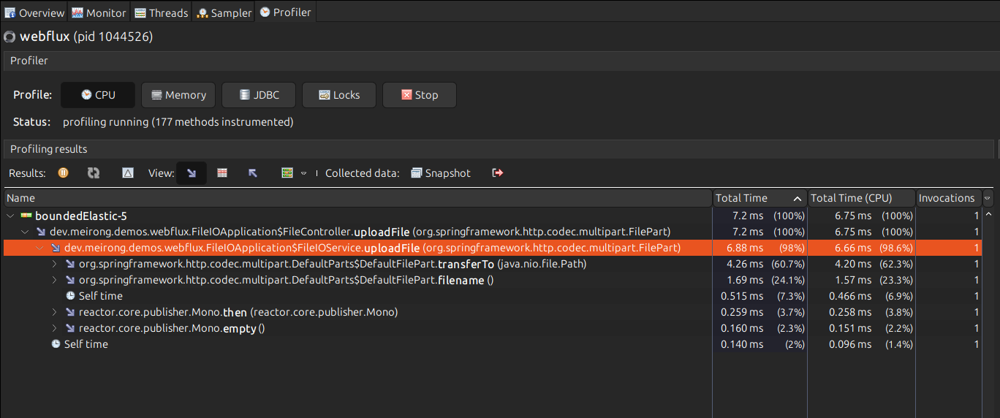
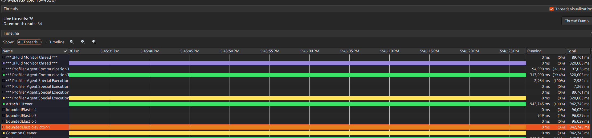
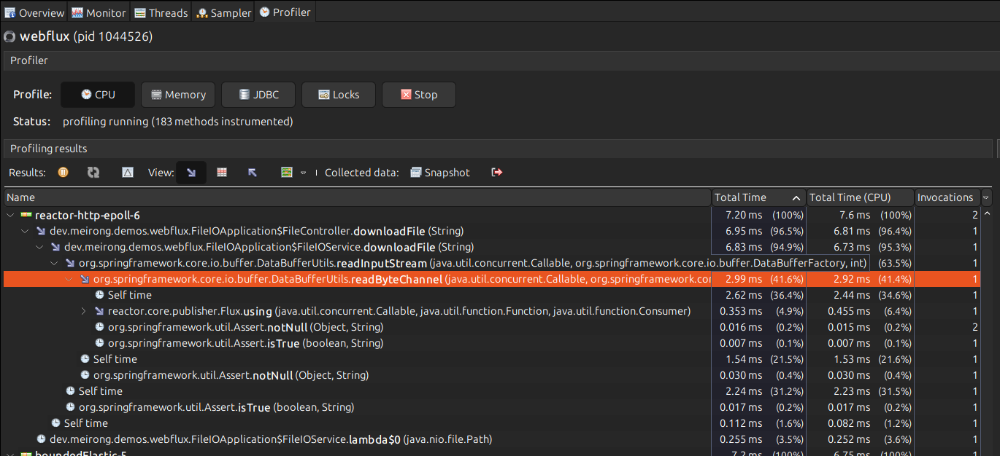

# File IO Operation

Show file upload and download operation.

[FileIOApplication](../../src/main/java/dev/meirong/demos/webflux/FileIOApplication.java)

## Prerequisites
- Python 3.6 or later
- Generate data for testing: python gendata.py

## File Upload

```bash
curl -X POST -F "file=@data.txt" http://localhost:8080/files/upload
``` 

The file io operation will be dispatched to the `boundedElastic` scheduler.


It's a dynamic pool that will grow and shrink based on the number of tasks that are pending.



## File Download

```bash
curl http://localhost:8080/files/download/data.txt
```

The download stream will be dispatched to the `reactor-http-epoll` thread pool.

