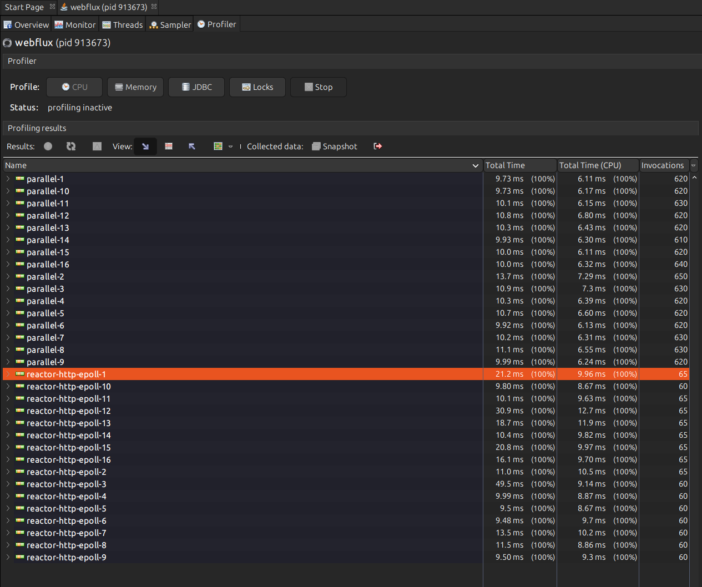
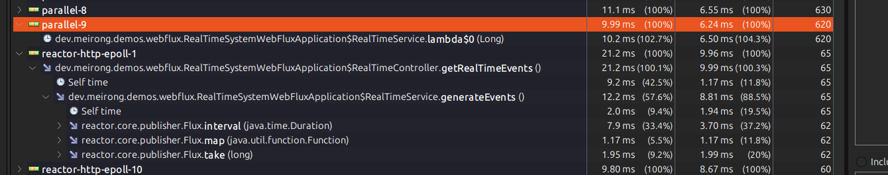

# VisualVM for profiling

## Environments
- My machine:
  - cpu: 16 cores
  - memory: 40gb
- [VisualVM](https://visualvm.github.io/)
- [Hey](https://github.com/rakyll/hey)
- Java17


## CPU Profiling

Purpose - Show how to do the cpu profiling with visualvm.

Demo app - [RealTimeSystemWebFluxApplication](../../src/main/java/dev/meirong/demos/webflux/RealTimeSystemWebFluxApplication.java)

It will 
- generate one event per second
- map the event to a string
- limit to 10 events to be generated

```java
    @Service
    public static class RealTimeService {
        public Flux<String> generateEvents() {
            return Flux.interval(Duration.ofSeconds(1))
                    .map(index -> "Event " + index)
                    .take(10); // Limit to 10 events
        }
    }
```

1000 requests with 200 concurrency, the average response time is 10.1472 secs.
```curl
hey -n 1000 -c 200 http://localhost:8080/api/events           [8:24:49]

Summary:
  Total:        51.5737 secs
  Slowest:      11.5515 secs
  Fastest:      10.0018 secs
  Average:      10.1472 secs
  Requests/sec: 19.3897
  

Response time histogram:
  10.002 [1]    |
  10.157 [818]  |■■■■■■■■■■■■■■■■■■■■■■■■■■■■■■■■■■■■■■■■
  10.312 [23]   |■
  10.467 [6]    |
  10.622 [0]    |
  10.777 [30]   |■
  10.932 [94]   |■■■■■
  11.087 [12]   |■
  11.242 [0]    |
  11.396 [6]    |
  11.551 [10]   |


Latency distribution:
  10% in 10.0023 secs
  25% in 10.0025 secs
  50% in 10.0033 secs
  75% in 10.0083 secs
  90% in 10.8025 secs
  95% in 10.8563 secs
  99% in 11.4389 secs

Details (average, fastest, slowest):
  DNS+dialup:   0.0062 secs, 10.0018 secs, 11.5515 secs
  DNS-lookup:   0.0020 secs, 0.0000 secs, 0.0506 secs
  req write:    0.0011 secs, 0.0000 secs, 0.0298 secs
  resp wait:    1.1408 secs, 1.0016 secs, 2.4893 secs
  resp read:    8.9961 secs, 8.5303 secs, 9.0173 secs

Status code distribution:
  [200] 1000 responses
```

### Check the result of the cpu profiling


- The `reactor-http-epoll` thread pool was responsible for the http request handling.
- The average number of the invocation for each thread is about `62.5`.(1000 requests / 16 cores)


- `map` operation was dispatched to the `parallel` thread pool.(each request will generate 10 events, so the average number of the invocation is about `625`)
- the `reactor-http-epoll` thread pool was responsible for the other operations.

### Gap between the `Total time` and `Total Time(CPU)`

The difference between the total time (10ms) and CPU time (6ms) `map` operation likely represents time spent in non-CPU activities, primarily:

1. Thread Parking/Scheduling
- In reactive applications, threads often need to park while waiting for data
- The scheduler may need time to coordinate thread handoffs
- Context switching overhead between threads

2. Async I/O Operations
- Even though map is a simple operation, in WebFlux's reactive pipeline it may involve:
- Event loop scheduling delays
- Thread pool queue waiting time
- Publisher/Subscriber handoffs

3. Memory Operations
- Time spent on object allocation
- Garbage collection pauses (if they occurred)
- [Memory fence/barrier](https://en.wikipedia.org/wiki/Memory_barrier) operations for thread safety

The 4ms gap (10ms - 6ms) represents this "waiting time" where the thread isn't actively using CPU cycles but is waiting for these reactive coordination activities to complete.
